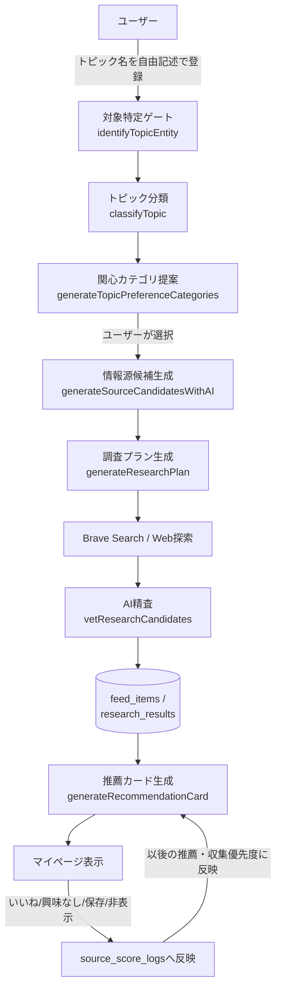

# アーキテクチャ仕様書

このドキュメントは、Antenna（関心情報ダッシュボード）の内部設計について、READMEより踏み込んだレベルで説明するものです。コードの実装と乖離した記述をしないよう、実際のソースコード（`lib/`・`app/`・`supabase/migrations/`）を根拠に記述しています。

## 目次

1. [全体像](#全体像)
2. [データモデル](#データモデル)
3. [認証](#認証)
4. [トピック登録〜情報収集〜推薦のパイプライン](#トピック登録情報収集推薦のパイプライン)
5. [33ジャンル統合エンジン（安全機構）](#33ジャンル統合エンジン安全機構)
6. [情報源の信頼性・スコアリング](#情報源の信頼性スコアリング)
7. [収集パイプラインのエラーハンドリング](#収集パイプラインのエラーハンドリング)
8. [iOSアプリのアーキテクチャ](#iosアプリのアーキテクチャ)

---

## 全体像

登録は「対象特定 → 分類 → 情報源発掘 → 調査 → 精査 → 推薦」という一方向のパイプラインですが、ユーザーのリアクションが情報源スコアにフィードバックされ、次回以降の収集・推薦に反映される循環構造になっています。

## データモデル

主要テーブル（`supabase/migrations/0001_init.sql`が基盤、以降のマイグレーションで拡張）:

| テーブル | 役割 |
|---|---|
| `profiles` | `auth.users`と1:1対応するユーザープロフィール |
| `topics` | ユーザーが登録した関心テーマ |
| `sources` | トピックに紐づく情報源（AIが発掘、または手動追加）。`status`は`candidate`/`active`/`paused`/`rejected` |
| `feed_items` | 情報源から収集した記事本体。`user_id, url`でユニーク制約 |
| `reactions` | 記事へのリアクション（`useful`/`not_relevant`/`save`/`hide`/`more_from_source`/`less_from_source`） |
| `source_score_logs` | リアクションによる情報源スコアの増減履歴 |
| `topic_classifications` | AIによるトピック分類結果（ジャンル・対象特定・時間的意図等） |
| `topic_preference_settings` | トピックごとの関心カテゴリ・表示トーン等の設定 |
| `recommendation_cards` | AIが生成した推薦カード |
| `recommendation_card_reactions` | 推薦カードへのリアクション（like/bad/save/hide） |
| `research_results` | 調査パイプライン（Brave Search経由）で見つかった候補記事とAI精査結果 |
| `source_domain_preferences` | ドメイン単位での好み設定 |
| `rate_limit_events` | レート制限用のイベント記録 |

すべてRow Level Security（RLS）で`user_id`ベースのアクセス制御がされており、ユーザーは自分のデータのみ参照・更新できます。

## 認証

- Supabase Auth（メール・パスワード方式）
- サインアップ確認は**リンク方式ではなく6〜10桁の確認コード（OTP）を画面に直接入力する方式**（メールアプリの自動スキャンによるリンク消費問題を回避するための設計。[components/auth/SignupForm.tsx](../components/auth/SignupForm.tsx)参照）
- パスワード再設定は確認リンク方式（`resetPasswordForEmail` → `/update-password`でセッション確立）
- セッションはCookieベース（`@supabase/ssr`）。`proxy.ts`（Next.js 16でのmiddleware相当）が`getUser()`でサーバー側検証を行い、保護パス（`/mypage`・`/topics`・`/sources`・`/saved`）への未認証アクセスを`/login`へリダイレクトする

## トピック登録〜情報収集〜推薦のパイプライン

各段階は[app/(app)/topics/actions.ts](../app/(app)/topics/actions.ts)から呼び出される、`lib/ai/`配下のAI呼び出しモジュール群で構成されます。すべてAnthropic Claude APIを使用し、レスポンスは`parseAiJsonSafely`（[lib/ai/parseAiJsonSafely.ts](../lib/ai/parseAiJsonSafely.ts)）経由で安全にパースされます。

### 1. 対象特定ゲート（`identifyTopicEntity`）

トピック名が曖昧な場合（同名の作品・人物が複数存在する等）、AIに候補実体（`CandidateEntity`）を提示させ、ユーザーに選択を求めます。`identificationStatus`は`identified`/`needs_selection`/`needs_more_info`/`not_identifiable`の4種類。事前にWeb探索（`lib/topic-identification/preliminaryTopicExploration.ts`）で手がかりを集めてから判定します。

### 2. トピック分類（`classifyTopic`）

対象特定済みのトピックについて、以下を判定します:

- **ジャンル**（33ジャンルのいずれか。詳細は次章）
- **対象者レベル**（`AUDIENCE_LEVELS`）
- **鮮度プロファイル**（`FRESHNESS_PROFILES`）— 最新情報が欲しいのか、体系的な情報が欲しいのか
- **時間的意図**（`TIME_INTENTS`）
- **情報ニーズ**（`INFORMATION_NEEDS`）

### 3. 関心カテゴリ提案（`generateTopicPreferenceCategories`）

分類結果をもとに、「集めたい情報カテゴリ」の選択肢を8〜10個提示し、ユーザーが5〜7個を選ぶ。これが後続の情報源発掘・調査プランの重み付けに使われます。

### 4. 情報源候補生成（`generateSourceCandidatesWithAI`）

トピック分類・関心カテゴリ設定をもとに、公式サイト・ニュースサイト・YouTubeチャンネル等の候補情報源をAIに提案させます。既存の確定済み公式URLと異なるドメインの候補は`needs_review`扱いになります。

### 5. 調査プラン生成（`generateResearchPlan`）

ジャンル設定（`getGenreConfig`）を反映した調査プランを生成します。調査チャンネル（`ResearchChannel`）、候補件数の予算（`ResearchCandidateBudget`）、情報源の優先度・必須要件、鮮度ポリシーなどを含みます。プラン生成に失敗した場合は`buildFallbackResearchPlan`でフォールバックします。

### 6. Web探索・検索実行

Brave Search APIを使ったクエリ実行（`lib/research/buildResearchQueriesFromPlan.ts`）と、`lib/web-discovery/`によるWebページ探索を並列実行します。カバレッジが不足していると判定された場合（`evaluateResearchCoverage`）、追加の補助検索（follow-up）を行います。

### 7. AI精査（`vetResearchCandidates`）

集まった候補記事を`use`（採用）/`hold`（保留）/`exclude`（除外）に判定します。AIによる判定の前に、決定論的フィルタ（`lib/research-review/deterministicFilters.ts`）でリスク・時期の観点から機械的に除外できるものを先に弾き、AIの負荷と誤判定リスクを減らしています。情報源の格（Tier）は`computeSourceTier`で算出されます。

### 8. 推薦カード生成（`generateRecommendationCard`）

採用された記事群から、ユーザー向けの推薦カードを生成します。ジャンル設定を参照し、リスクレベル（`normal`/`moderate`/`high`/`critical`）に応じて注意喚起文を付与します（次章参照）。

### 9. 記事タイトル・要約の最適化（`generateFeedItemOptimization`）

RSS由来の記事について、トピックとの関係が伝わるようタイトル・要約をAIが書き直します（開発者向けの手動実行機能。設定画面から実行可能）。

## 33ジャンル統合エンジン（安全機構）

[lib/genres/](../lib/genres/)配下に、33ジャンル（音楽・映画・アニメ・ゲーム・グルメ・ペット・地域イベント等）ごとの詳細設定を持つ仕組みがあります。各ジャンルは以下を持ちます:

- **三層構造の情報源ポリシー**（`sourceLayers.tier1/2/3`）: 用途・情報源カテゴリ・許可される使い方・禁止される使い方を層ごとに定義。例えばTier1（公式発表）は「日時・料金の確定」に使えるが、Tier3（SNS等）は「発見・反応の把握」にのみ使え、「安全性の確定」等には使えない、というルール
- **鮮度ルール**（`freshnessRules`）: 情報種別ごとの推奨鮮度期間
- **スコアリング重み**（`scoringWeights`）: 関連度・鮮度・信頼性・話題性・緊急性など11軸の重み付け。ジャンルごとに上書き可能（例: ペット・動物ジャンルは信頼性の重みを引き上げ）
- **除外ルール**（`exclusionRules`）
- **リスクレベル**（`defaultRiskLevel`）と**必要独立情報源数**（`minimumIndependentSources`）

### 高リスク警告（`highRiskWarning`）

特定の情報タイプ（中毒・副作用・警告・リコール等）を含む推薦カードには、ジャンル固有の注意喚起文を付与します。現状、内容が用意されているのは**ペット・動物ジャンルのみ**です（例: 「緊急時は自己判断せず、まず動物病院へ連絡してください」）。他ジャンルは中身の無い警告文を捏造しないという方針のもと、汎用の確認喚起文にフォールバックします。他ジャンルへ拡張する場合は[lib/genres/genreConfigs.ts](../lib/genres/genreConfigs.ts)の該当ジャンルに`highRiskWarning`・`professionalSourcePatterns`を追記するだけで反映されます。

### 専門情報源パターン（`professionalSourcePatterns`）

「Verified professional source」（Tier2相当の専門情報源）と認定するための、ジャンル固有の正規表現パターンです。ドメイン文字列だけでなく、本文中に施設種別を示す語（例: 「動物病院」）と運営情報を示す語（例: 「獣医師」「診療時間」）の両方が確認できる場合のみ認定する、誤認定に慎重な設計です。

### 横断ルール（`CrossGenreResearchRule`）

ジャンル単位では表現しきれない、複数ジャンルにまたがる収集ルール（[lib/genres/crossGenreRules.ts](../lib/genres/crossGenreRules.ts)）。

## 情報源の信頼性・スコアリング

- `sources.source_score`: リアクションの蓄積によって増減するスコア。ユーザーの「もっと見たい」「減らしたい」等の意思表示を反映
- `source_score_logs`: スコア変動の履歴（理由付き）
- `lib/research-review/sourceTier.ts`: 情報源の格（Tier）判定。ジャンル固有の`professionalSourcePatterns`があれば優先的に参照
- `source_domain_preferences`: ドメイン単位の好み（特定ドメインを優遇/減点）

## 収集パイプラインのエラーハンドリング

- RSS取得の失敗は`sources.fetch_status`（`unverified`/`verified`/`broken`）と`last_fetch_error_type`/`last_fetch_error_message`に記録
- `consecutive_fetch_failure_count`（連続失敗回数）を記録し、**3回以上連続で失敗した場合のみ**「URLを見直すか一時停止することをおすすめします」という導線付きの警告に切り替える（1〜2回は一時的な不調とみなし通常表示のまま）。自動での一時停止・削除は行わず、常にユーザーの操作を介する設計（[components/sources/SourceCard.tsx](../components/sources/SourceCard.tsx)参照）
- RSS取得・Brave検索クエリ・公式サイトクロール等の収集ループは`Promise.all`で並列化済み

## iOSアプリのアーキテクチャ

Capacitorの`server.url`方式を採用し、本番Web（`https://www.myantenna.app`）をそのままWKWebViewで開く構成です。Server Actions・Cookieベース認証・サーバー側レンダリングを多用しているため、Web側のコードを静的バンドルする方式は採らず、Webアプリのコードを一切変更せずにそのままネイティブアプリとして動作させています。

- Webアプリ側を更新・再デプロイするだけで、インストール済みのアプリにも自動反映される（Xcodeでの再ビルドが不要）
- ネイティブ側の独自コードは最小限（Capacitor標準生成の`AppDelegate.swift`等のみ）
- 詳細な構築手順は[README_IOS_APP.md](../README_IOS_APP.md)を参照
